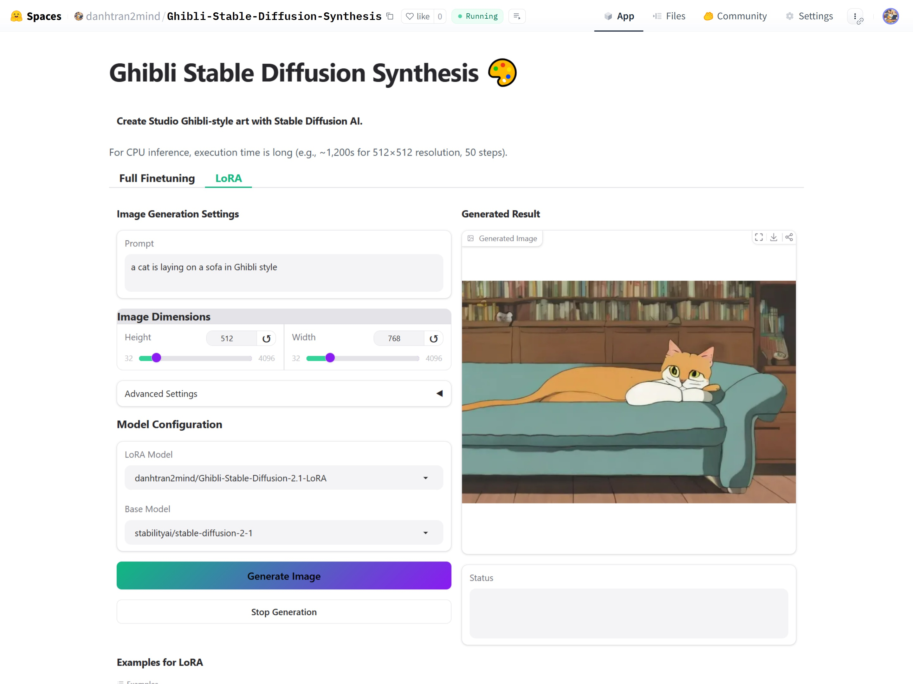

# Ghibli Stable Diffusion Synthesis 🎨

[](https://github.com/danhtran2mind/Ghibli-Stable-Diffusion-Synthesis/stargazers)


[](https://huggingface.co/docs/hub)
[](https://huggingface.co/docs/accelerate)
[](https://github.com/TimDettmers/bitsandbytes)
[](https://pytorch.org/)
[](https://pypi.org/project/pillow/)
[](https://numpy.org/)
[](https://huggingface.co/docs/transformers)
[](https://pytorch.org/vision/stable/index.html)
[](https://huggingface.co/docs/diffusers)
[](https://gradio.app/)
[](https://opensource.org/licenses/MIT)

## Introduction

The **Ghibli Fine-Tuned Stable Diffusion 2.1** project is a cutting-edge endeavor that harnesses the power of deep learning to generate images in the enchanting and iconic art style of Studio Ghibli. By fine-tuning the Stable Diffusion 2.1 model, this project enables the creation of visually stunning images that capture the vibrant colors, intricate details, and whimsical charm of Ghibli films. The repository includes a meticulously crafted Jupyter notebook for training, an interactive Gradio demo for real-time image generation, and comprehensive instructions for setup and usage. Designed for data scientists, developers, and Ghibli enthusiasts, this project bridges technology and artistry with unparalleled precision.

## Key Features

## Training Notebooks

### For `Full Finetuning` training
The cornerstone of this project is the Jupyter notebook located at `notebooks/ghibli-sd-2.1-base-finetuning.ipynb`. This notebook provides a step-by-step guide to fine-tuning the `Stable Diffusion 2.1 Base` model using the Ghibli dataset, complete with code, explanations, and best practices. It is designed to be accessible to both beginners and experienced practitioners, offering flexibility to replicate the training process or experiment with custom modifications. The notebook is compatible with the following platforms:

[](https://colab.research.google.com/github/danhtran2mind/Ghibli-Stable-Diffusion-Synthesis/blob/main/notebooks/ghibli-sd-2.1-base-finetuning.ipynb)
[](https://studiolab.sagemaker.aws/import/github/danhtran2mind/Ghibli-Stable-Diffusion-Synthesis/blob/main/notebooks/ghibli-sd-2.1-base-finetuning.ipynb)
[](https://deepnote.com/launch?url=https://github.com/danhtran2mind/Ghibli-Stable-Diffusion-Synthesis/blob/main/notebooks/ghibli-sd-2.1-base-finetuning.ipynb)
[](https://mybinder.org/v2/gh/danhtran2mind/Ghibli-Stable-Diffusion-Synthesis/main?filepath=notebooks/ghibli-sd-2.1-base-finetuning.ipynb)
[](https://console.paperspace.com/github/danhtran2mind/Ghibli-Stable-Diffusion-Synthesis/blob/main/notebooks/ghibli-sd-2.1-base-finetuning.ipynb)
[](https://mybinder.org/v2/gh/danhtran2mind/Ghibli-Stable-Diffusion-Synthesis/main?filepath=notebooks/ghibli-sd-2.1-base-finetuning.ipynb)
[](https://www.kaggle.com/notebooks/welcome?src=https%3A%2F%2Fgithub.com%2Fdanhtran2mind%2FGhibli-Stable-Diffusion-Synthesis%2Fblob%2Fmain%2Fnotebooks%2Fghibli-sd-2.1-base-finetuning.ipynb)
[](https://github.com/danhtran2mind/Ghibli-Stable-Diffusion-Synthesis/blob/main/notebooks/ghibli-sd-2.1-base-finetuning.ipynb)

### For `LoRA` training
The foundation of this project is the Jupyter notebook found at `notebooks/ghibli-sd-2.1-lora.ipynb`. It offers a clear, step-by-step walkthrough for fine-tuning the `Stable Diffusion 2.1` model with the Ghibli dataset using LoRA (Low-Rank Adaptation), including code, detailed notes, and practical tips. Crafted for both novices and seasoned users, it supports easy replication of the training process or experimentation with custom tweaks. The notebook is compatible with the following platforms:

[](https://colab.research.google.com/github/danhtran2mind/Ghibli-Stable-Diffusion-Synthesis/blob/main/notebooks/ghibli-sd-2.1-lora.ipynb)
[](https://studiolab.sagemaker.aws/import/github/danhtran2mind/Ghibli-Stable-Diffusion-Synthesis/blob/main/notebooks/ghibli-sd-2.1-lora.ipynb)
[](https://deepnote.com/launch?url=https://github.com/danhtran2mind/Ghibli-Stable-Diffusion-Synthesis/blob/main/notebooks/ghibli-sd-2.1-lora.ipynb)
[](https://mybinder.org/v2/gh/danhtran2mind/Ghibli-Stable-Diffusion-Synthesis/main?filepath=notebooks/ghibli-sd-2.1-lora.ipynb)
[](https://console.paperspace.com/github/danhtran2mind/Ghibli-Stable-Diffusion-Synthesis/blob/main/notebooks/ghibli-sd-2.1-lora.ipynb)
[](https://mybinder.org/v2/gh/danhtran2mind/Ghibli-Stable-Diffusion-Synthesis/main?filepath=notebooks/ghibli-sd-2.1-lora.ipynb)
[](https://www.kaggle.com/notebooks/welcome?src=https%3A%2F%2Fgithub.com%2Fdanhtran2mind%2FGhibli-Stable-Diffusion-Synthesis%2Fblob%2Fmain%2Fnotebooks%2Fghibli-sd-2.1-lora.ipynb)
[](https://github.com/danhtran2mind/Ghibli-Stable-Diffusion-Synthesis/blob/main/notebooks/ghibli-sd-2.1-lora.ipynb)

To get started, open the notebook in your preferred platform and follow the instructions to set up the environment and execute the training process.

## Datasets

Each task employs a dedicated dataset hosted on HuggingFace, tailored to support the unique requirements of the training process while reflecting Ghibli’s distinctive artistry:

-   **Full Fine-Tuning Task**: Utilizes [](https://huggingface.co/datasets/uwunish/ghibli-dataset), a comprehensive collection of high-quality Ghibli-inspired images designed for thorough model fine-tuning, ensuring rich and authentic visual outputs.
-   **LoRA Task**: Leverages [](https://huggingface.co/datasets/pulnip/ghibli-dataset), a lightweight and optimized dataset crafted for LoRA adaptation, enabling efficient training with reduced computational resources while maintaining the charm of Ghibli’s style.

## Base Models

The project uses carefully selected Stable Diffusion models for each task, balancing quality, efficiency, and alignment with Ghibli’s artistic vision:

-   **Full Fine-Tuning Task**: Built on [](https://huggingface.co/stabilityai/stable-diffusion-2-1-base), a powerful base model ideal for extensive fine-tuning, producing detailed and faithful Ghibli-style artwork with high fidelity.

-   **LoRA Task**: Based on [](https://huggingface.co/stabilityai/stable-diffusion-2-1), a versatile model optimized for LoRA, offering a streamlined approach for rapid experimentation and efficient generation of Ghibli-inspired visuals.

## Demonstration
License-Plate-Detector-OCR uses computer vision, OCR to detect, read license plates:
- **HuggingFace Space**: [](https://huggingface.co/spaces/danhtran2mind/Ghibli-Stable-Diffusion-Synthesis)

- **Demo GUI**:  
  

To run the Gradio app locally (`localhost:7860`):  
```bash
python apps/gradio_app.py
```

## Usage Guide
### Step 1: Clone the Repository
Clone the project repository and navigate to the project directory:
```bash
git clone https://github.com/danhtran2mind/Ghibli-Stable-Diffusion-Synthesis.git
cd Ghibli-Stable-Diffusion-Synthesis
```

### Step 2: Install Dependencies
Install Dependencies using `requirements.txt`
```bash
pip install -r requirements/requirements.txt
```

### Step 3: Configure the Environment
Run the following scripts to set up the project:
<!-- - **Install Third-Party Dependencies**  
  ```bash
  python scripts/setup_third_party.py
  ``` -->
#### **Download Model Checkpoints**
```bash
python scripts/download_ckpts.py
```
#### **Prepare Dataset (Optional, for Training)**  
  ```bash
  python scripts/download_datasets.py
  ```

Refer to the [Scripts Documents](docs/scripts/scripts_doc.md) for detailed arguments used in Scripts. ⚙️

### Training
The Training Notebooks, available at [Training Notebooks](#training-notebooks), offer a comprehensive guide to both the Full Fine-tuning and LoRA training methods.


To use local datasets downloaded from Hugging Face Datasets, replace `--dataset_name` with the following in the specified notebooks:

- In `notebooks/ghibli-sd-2.1-base-finetuning.ipynb`, replace  `--dataset_name="uwunish/ghibli-dataset"` with by `--dataset_name="data/uwunish-ghibli-dataset"`.
- In `notebooks/ghibli-sd-2.1-lora.ipynb`, replace `--dataset_name="pulnip/ghibli-dataset"` with  `--dataset_name="data/pulnip-ghibli-dataset"`.

For more information about Training, you can see [Stable Diffusion text-to-image fine-tuning](https://github.com/huggingface/diffusers/tree/main/examples/text_to_image).


<!-- #### Config
Configuration of the `accelerate`
```bash
accelerate config default
```
#### Training Bash
To train the model:
```bash
accelerate launch ./src/f5_tts/train/finetune_cli.py \
    --exp_name F5TTS_Base \
    --dataset_name vin100h-preprocessed-v2 \
    --finetune \
    --tokenizer pinyin \
    --learning_rate 1e-05 \
    --batch_size_type frame \
    --batch_size_per_gpu 3200 \
    --max_samples 64 \
    --grad_accumulation_steps 2 \
    --max_grad_norm 1 \
    --epochs 80 \
    --num_warmup_updates 2761 \
    --save_per_updates 4000 \
    --keep_last_n_checkpoints 1 \
    --last_per_updates 4000 \
    --log_samples \
    --pretrain "<your_pretrain_model>"# such as "./ckpts/F5TTS_v1_Base_no_zero_init/model_1250000.safetensors"
```
#### Training Arguments
Refer to the [Training Documents](docs/training/training_doc.md) for detailed arguments used in fine-tuning the model. ⚙️ -->

### Inference
#### Quick Inference Bash
- To generate iamge using the `Full Fine-tuning` model:
```bash
python src/ghibli_stable_diffusion_synthesis/infer.py \
    --method full_finetuning \
    --prompt "donald trump in ghibli style" \
    --height 512 --width 512 \
    --num_inference_steps 50 \
    --guidance_scale 3.5 \
    --seed 42 \
    --output_path "tests/test_data/ghibli_style_output_full_finetuning.png"
```
- To run inference with `LoRA`:
```bash
python src/ghibli_stable_diffusion_synthesis/infer.py \
    --method lora \
    --prompt "a beautiful city in Ghibli style" \
    --height 720 --width 1280 \
    --num_inference_steps 100 \
    --guidance_scale 15.5 \
    --seed 42 \
    --lora_scale 0.7 \
    --output_path "tests/test_data/ghibli_style_output_lora.png"
```
#### Inference Arguments
Refer to the [Inference Documents](docs/inference/inference_doc.md) for detailed arguments used in Inference. ⚙️
### Inference Example

## Environment
- **Python**: 3.10 or higher
- **Key Libraries**: See [requirements_compatible.txt](requirements/requirements_compatible.txt) for compatible versions

## Contact

For questions, issues, please contact the maintainer via the [Issues tab](https://github.com/danhtran2mind/Ghibli-Stable-Diffusion-Synthesis/issues) on GitHub.